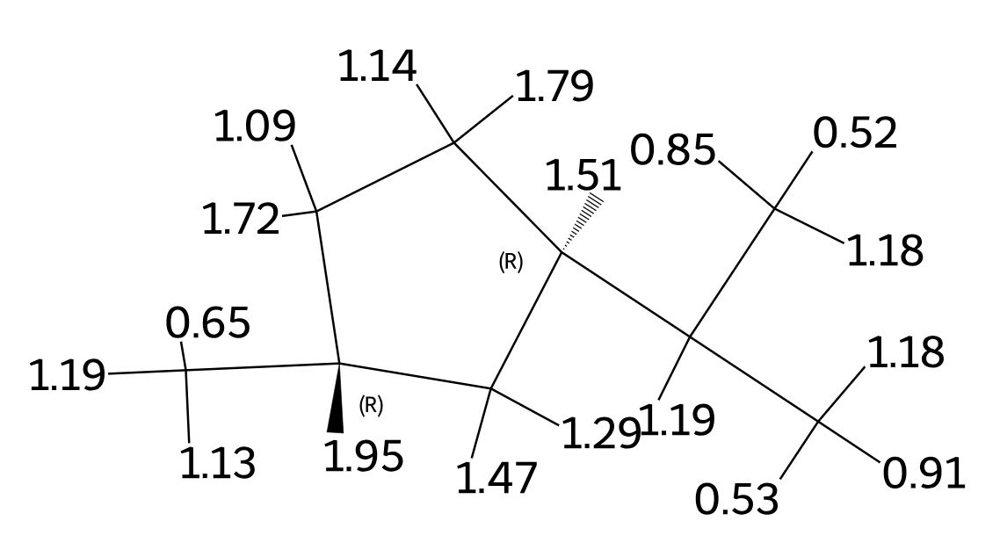
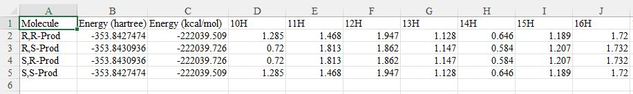
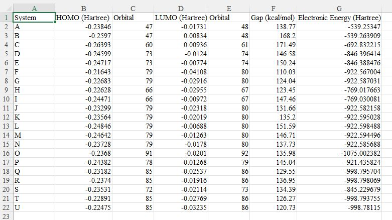
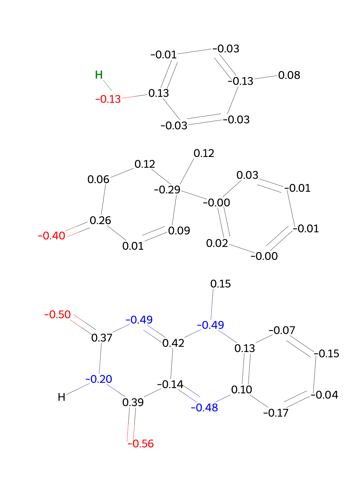
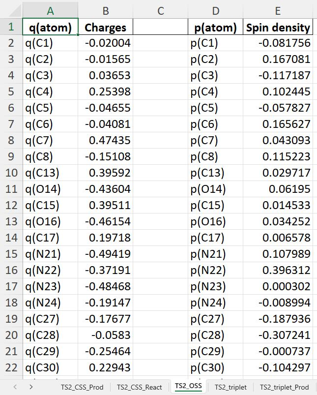
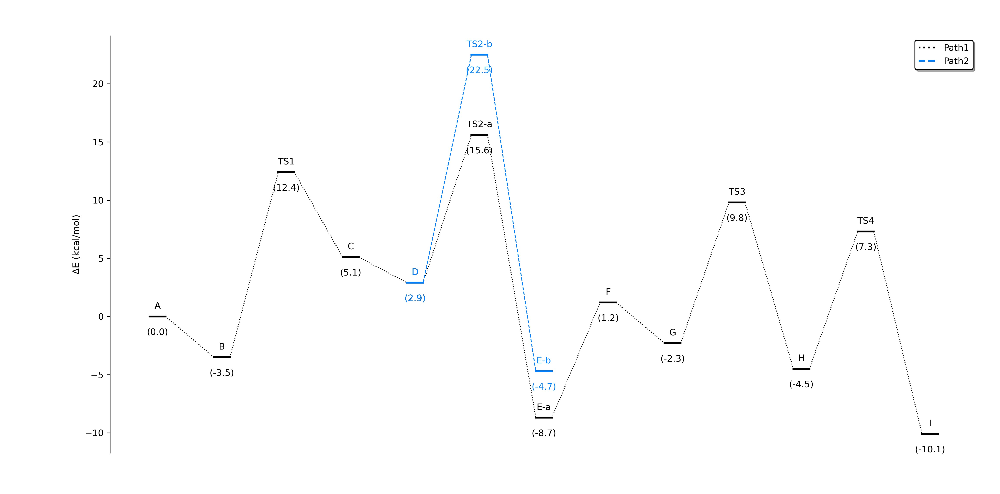
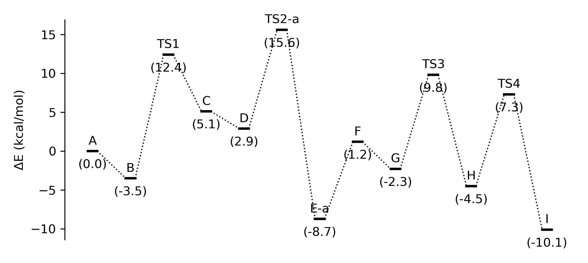

This repository contains a collection of Python scripts designed to automate the processing, analysis, and visualisation of data from computational chemistry calculations, specifically those generated by the Gaussian software.

 

**Scripts**

 

*1. NMR.py*
   
 

   This tool is designed for the automated analysis of Nuclear Magnetic Resonance (NMR) calculations. It extracts chemical shift values for both ¹H and ¹³C nuclei, generates a CSV file with all the data, and produces SVG images of the molecules with the corresponding chemical shifts as labels. A TMS reference file (TMS.out) is required for the calculation.

 

   

   
   
 

*2. multigap.py*

 

   This script analyses the results of HOMO-LUMO calculations. It extracts information on the HOMO, LUMO, and other nearby orbitals to calculate the energy gaps. It generates a text file with a summary of the gaps for each molecule.

 

   

 

*3. qp.py*

 

   A tool for extracting and visualising Mulliken charges and spin densities from Gaussian output files. The script generates an Excel file with the numerical data and creates clear SVG images of the molecule, labelled with the charge or spin density values. It offers the flexibility to get molecular geometry from either Gaussian output files or external .xyz files.

 

   

   

 

*4. xyz.py*

 

   A molecular visualization tool that processes a custom .xyz file format. The script uses RDKit to build the molecule and generate a clear SVG image.

 

   

 

*5. PES.py*

 

   A graphical user interface (GUI) tool for plotting energy profiles from data contained in Excel files. See PES_Example.xlsx

 

   
   
   

   

  

**RECOMMENDATIONS:** 
- Visual Studio Code (Free) to run scripts.
  
- Inkscape (Free) to edit SVG files.

  

**Contributions** are welcome! If you have ideas for improving functionality, adding new tools, or fixing bugs, feel free to open an issue, submit a pull request or email me.

  

**Author: Cristina Berga**

**Contact: cristina.berga@udg.edu**
